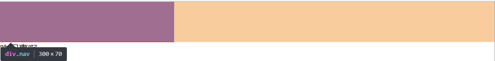
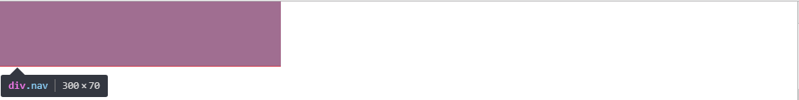
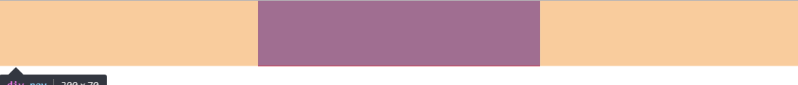

## 示例代码

```html
<div class="header">
  <div class="nav"></div>
</div>
```

```css
* {
  margin: 0;
  padding: 0;
}
.header {
  height: 70px;
}
.nav {
  height: 70px;
  background: red;
}
```

## 当需要居中的 div 设置了固定宽度

### margin

```css
.nav {
  height: 70px;
  background: red;
  width: 300px;
  margin: 0 atuo;
}
```

`auto` 可以理解为一样的意思，如果左右都设置 `auto`，意思就是这个 `div` 离左面的距离和右面的距离是一样的,但是此方法只适用于设置了宽度的块级元素。而且当只设置了 `position:absolute` 或者 `float` 或者 `display:inline` 时,`margin:0 auto` 也会失效。

**原因**:arrow_lower_left:

块级元素始终独占一行，无论是否设置了宽度，未设置宽度时他会自动充满，设置了宽度时，虽然他看起来这一行并不都是他的地盘，但是你如果在他后面添加元素的时候，你会发现元素会被挤到下一行去。

```html
<div class="header">
  <div class="nav"></div>
  咋回事啊
</div>
```


怎么肥四，为森么会发生这种情况呢，再看一下面一张图



可以看到，虽然 `div` 设置了宽度，但是他有一种无形的力量占据了他所在的行的剩下的空间，以至于其它元素无法与其在一行。而这一块橙色区域也就是 `margin:0 auto` 可调控区域，`auto` 会根据这一部分的大小及时分配左右的距离，达到居中的效果，当设置了绝对定位、浮动或将其设置为行内元素的时候，他这种「威慑力」便会消失，`auto` 可分配的区域便会消失



可以看到，此时那块黄色的区域已经消失，`margin: 0 atuo` 也就失效了

不过也有一种例外

```css
.nav {
  height: 70px;
  background: red;
  width: 300px;
  position: absolute;
  left: 0;
  right: 0;
  margin: 0 atuo;
}
```

此时虽然已经设置绝对定位，div 也已经脱离了标准文档流，但是 `left:0 right:0` 又让其具有了那种「威慑力」，具有了 `margin:0 auto` 可调控的区域



### 绝对定位

```css
.nav {
  height: 70px;
  background: red;
  width: 300px;
  position: absolute;
  left: 50%;
  margin-left: -150px;
}
```

设置绝对定位让其拥有 `left` 属性，然后设定 `left:50%`，但是因为此 div 本身还有宽度，因此还要添加 `margin-left:-此div宽度的一半px;` 让其真正的居中

## 需要居中的 div 没有宽度

很多状况下我们要居中的元素是不知道宽度的，有时候可能宽度也不是固定的，因为里面的内容有可能以后要增加，或者随着浏览器的变化此宽度可能也要跟随变化，下面将示例代码的 css 改为如下形式

```css
.nav {
  height: 70px;
  background: red;
}
```


可以看到，当不设置宽度的时候，此 div 默认是充满整个浏览器的，这样的话就无所谓居中或不居中了，通常我们要居中这个 div，是想让这个 div 中的一些信息居中，为了便于演示，我在 html 和 css 中多添加了几行代码

```html
<div class="header">
  <div class="nav">
      <ul>
        <li>热爱前端</li>
        <li>热爱编程</li>
        <li>热爱生活</li>
        <li>渴望知识</li>
      </ul>
  </div>
</div>
```

```css
* {
  margin: 0;
  padding: 0;
}
.header {
  height: 70px;
}
.nav {
  height: 70px;
  background: red;
  line-height: 70px;
  color: #fff;
}
ul {
  list-style: none;
}
li {
  float: left;
  margin-left: 30px;
}
```

**效果图**


此时我们应该想办法让 div 的宽度不是充满整个浏览器，让它的宽度仅仅就是里面内容的宽度，这样我们才能让它居中。在块状元素下，如果不设置宽度，它始终是要充满整个宽度的。

```css
.nav {
  height: 70px;
  background: red;
  line-height: 70px;
  color: #fff;
  display: inline-block;
}
```

当设置 `nav` 为行内元素，或者 `table` 元素的时候他的宽度就默认不是最大化，而是根据包裹的内容改变，也就是最小化。设置为 `position` 或者 `display:table` 也一样。


### text-align:center

用 `text-align:center` 实现元素居中，这个属性不是只能让文本居中，它可以让**行内元素居中**，所以只要把要居中的元素设置为行内元素，然向其父元素添加 `text-align:center` ，就可以实现居中

```css
.header {
  height: 70px;
  text-align: center;
}
.nav {
  height: 70px;
  background: red;
  line-height: 70px;
  color: #fff;
  display: inline-block;
}
```

### display:table

设置 `nav` 为 `display:table` ,`nav` 就相当与说就具有了 `table` 的属性，那我们都知道 `table` 的宽度是根据其内容的多少而变化的，也就是宽度最小化，而此时 `nav` 便也可以使用 `margin:0 auto` 来居中

```css
.nav {
  height: 70px;
  background: red;
  line-height: 70px;
  color: #fff;
  display: table;
  margin: 0 auto;
}
```
