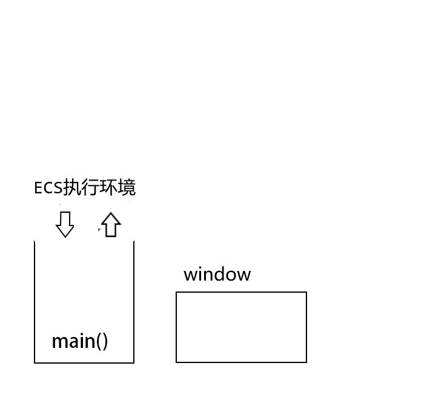
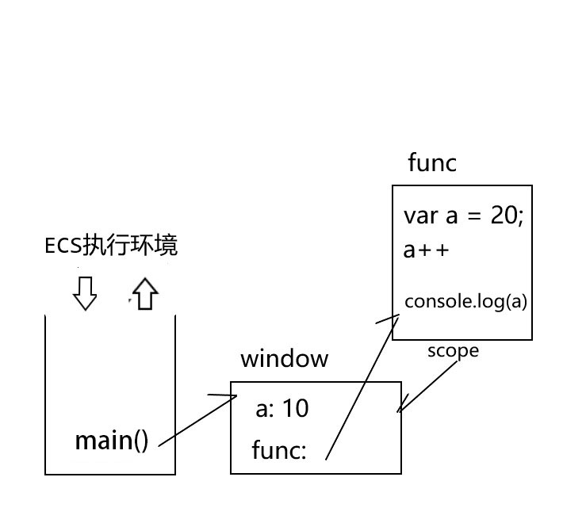
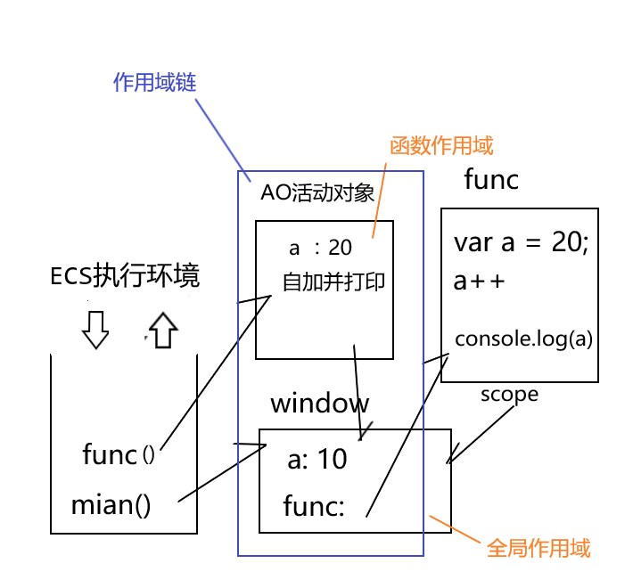
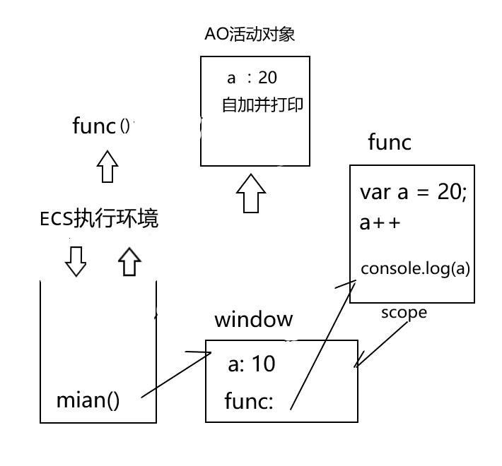
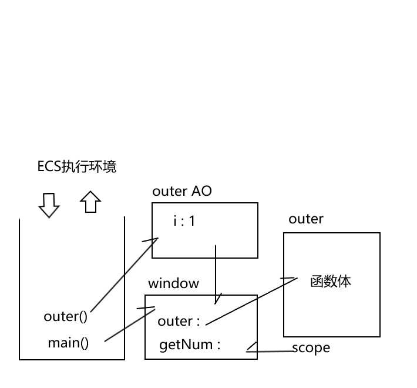
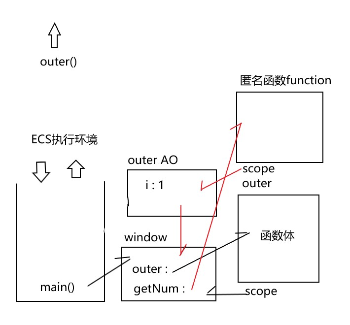
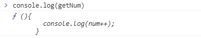
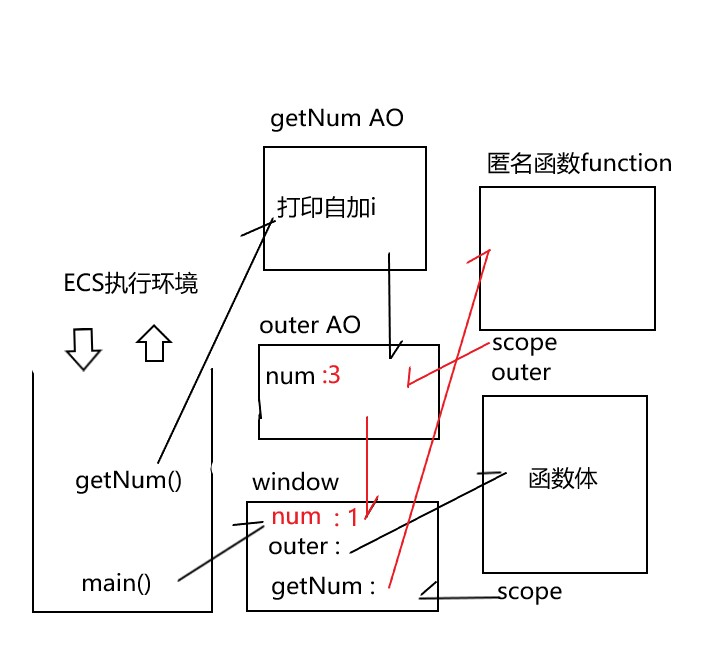
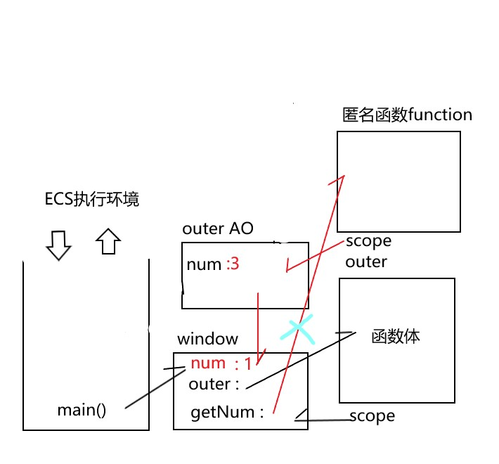

## 引言

网络上关于作用域及闭包的文章很多，但自己对于纯理论知识并不能很快的理解，但自己对于图画有很强的记忆能力，因此决定将此知识点以图画的知识表现出来，加深自身理解的同时如果能帮到正在学习的童鞋就再好不过了

下面我以函数的整个生命周期来诉说此部分知识

## 函数生命周期

先写一下示例代码

```js
var a = 10;
function func(a) {
  var a = 20;
  a++;
  console.log(a);
}
func();
console.log(a);
```

### 开始执行程序前



1.  先创建 ECS，ECS 其实就是专门保存正在调用的函数的执行环境的数组，也可以说对象，其实关联数组也就相当于对象。

2.  然后在 ECS 中添加浏览器主程序的执行环境 main

3.  创建全局作用域对象 window

4.  main 执行环境引用 window

### 定义函数时



1.  原始类型的全局变量会直接存入 window 环境当中，因为函数是引用类型，所以首先用函数名声明全局变量

2.  然后创建函数对象，封装函数定义

3.  函数对象的 scope 属性，指回函数创建时的作用域，意思是，函数执行时如果函数本身提供的变量不能让函数执行完全，那它便会去回它创建时的那个作用域去寻找变量。

4.  函数名后面存入指向函数对象的地址

引用类型在其中只能存储地址，这个在此笔记[谈谈值传递](https://github.com/MLuminary/Blog/issues/1)中有详细说明

### 函数调用时



1.  向 ECS 中压入本次函数调用的执行环境元素

2.  创建本次函数调用时使用的函数作用域对象（AO），也就是临时作用域

3.  在 AO 中创建储存所有的局部变量，包括形参变量和函数内用 var 声明的变量

4.  设置 AO 的 parent 属性和引用函数的 scope 属性指向父级作用域对象

5.  函数的执行环境引用 AO

6.  顺着那个箭头，先在 AO 中找变量，也就是局部变量，如果 AO 中没有，再顺着箭头去父级作用域中找

### 函数调用后



函数的执行环境出栈，AO 释放，AO 中的局部变量一同被释放掉。

我们得知整个结果之后，自然而然那两个 `console` 的结果也显然意见。

## 闭包

前面我们提到过，全局变量是可重用但是污染全局，局部变量不会污染全局但是不可重用。

我自己认为闭包就是重用变量又保护变量不被污染的机制，就是为了解决这一情况而生的。

### 特点

**包裹受保护的变量和操作变量的内层函数的外层函数**

**外层函数要返回内层函数的对象**

* `return function(){..}`
* 直接给全局变量赋值一个内部 `function`
* 将内部函数保存在一个对象的属性或数组元素中 `return [function function function]` 或 `return {fun:function(){...}}`

**调用外层函数，用外部变量接住返回的内层函数对象,形成闭包。**

### 原理

先贴出示例代码

```js
function outer() {
  var num = 1;
  return function() {
    console.log(num++);
  };
}

var getNum = outer();
getNum();
getNum();
num = 1;
getNum();
```

下面我把闭包形成的原理用画图工具画出来



window 中存入 outer 名并指向 outer 函数对象，`getNum` 因为声明提前也先将变量名存在 window 中。

`getNum = outer()` 其实包含 outer 的创建和 `getNum` 的赋值。

上面的图画的是 outer 函数进行到 `var num = 1;` ,前面都有说过，不过多重复。



创建了匿名函数，`getNum` 指向了匿名函数对象，匿名对象的 scope 指向它的父级作用域，也就是 outer 的作用域，那这样就形成了图中的三角关系，此时 outer 执行完毕，离开 ECS 执行环境，outer 的 AO 本也应该随着离开，**但是因为这强大的三角关系，强行拉住不让其释放**，也就形成了所谓的闭包。

**那其实闭包的原因就是**:外层函数的作用域对象无法释放


`getNum=outer()`getNum 其实就是一个函数



调用`getNum()`,会生成 `getNum` 的临时作用域,图中可看出,`getNum` 其实就是在 outer 中的匿名函数，所以他的 parent 就指向 outer 留下的作用域。当他执行 `console.log(num++)` 的时候，在他的作用域中没有 `num` 变量他就会顺着作用域链去寻找，最终在 outer 中的作用域中找到 `num` 并对其进行自加操作。**所以当下次调用 getNum 的时候 num 会从 2 开始，不会是一开始的 1**。

num 不是全局变量，还实现了 num 变量的重复调用。就达到了闭包的目的。



设置 `num = 1` 只是在 `window` 对象上添加存储 `num` 的值，当下次调用 `getNum` 的时候 js 引擎还会从 `getNum` 作用域开始顺着作用域链寻找 `num`,在 outerAO 就会寻找到 `num`,所以根本不会影响到 window 中的 `num`,也不会受其影响。因此此段代码输出的结果为 `1 2 3`。

### 缺点

当然闭包也有其缺点

* 比普通函数占用更多内存，因为外层函数的作用域对象（AO）始终存在

* 容易造成内存泄漏

### 解决办法

将引用内存函数对象的外部变量重置为 null

```js
getNum = null;
```



getNum 指向 outer 函数对象的那根线就会断掉，三角关系破裂，那函数对象和 outerAO 也会相继被销毁。

