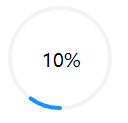
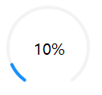

## 基于 mpvue 的圆形进度条组件

##### 默认状态



##### 圆形带缺口



### 引言

自己本身是一个小程序小白，前几天刚开始学习。碰到一个需求是要实现多个圆形带缺口的进度条，在网上没有找到相关插件后决定自己编写一个，如果能帮到需要的人那真是太好了, 下面会介绍一下自己的实现过程，如果只关心如何用的话可以传送到下面的页面

### 过程

一开始的思路是用 svg， 自己编写完毕后，发现小程序不支持直接引入 svg， 因此最终实现是使用的小程序自带的 canvas

如何画圆已经有大佬讲解过了，我就不重复劳动了，下面是链接

https://segmentfault.com/a/1190000013219501

在此说明一下此组件实现的功能和一些注意点

### 完全响应式

#### 适应包裹元素的宽度和高度

一开始的思路是设置 canvas 的宽高为 100%，发现并没有什么用，然后想获取 canvas 动态改变其宽高，发现小程序不能操作 dom, `ref` 也都不能使用。因此只能设置一个 `props`,麻烦使用者告知一下父元素的宽高，在这里因为此图形是一个正方形，所以只需要传递一个值就可以了。

#### 适应设备的宽度和高度

canvas 中的画布单位默认都是 px，画出来的图形是不能很好的适应宽度不同的设备的，因此自己在内部实现了一个 rpx，具体实现思路如下

```js
getRpx () {
  let rpx = 1 // 相对单位
  return new Promise(resolve => {
    wx.getSystemInfo({
      success: function (res) {
        rpx = res.windowWidth / 375
        resolve(rpx)
      }
    })
  })
}
```
然后与之前的画布的数值相乘即可，想具体看怎么实现的可以去看下源码

### 有关 canvas-id

canvas 在一个页面中 id 是不能相同的，就算出现相同的也只会渲染第一个，因此需要多个 canvas 只能让其 id 各不相同。使用者想使用多个圆形进度条组件的时候，请传递 `canvasId` 值。

