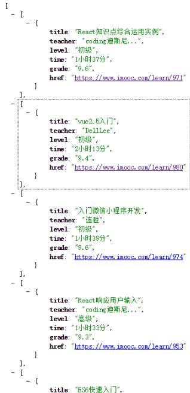
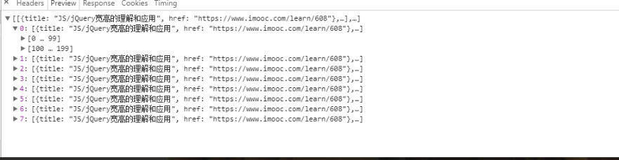

## 引言

在学习了 alsotang 大神的 《Node.js包教不包会》后的一个爬虫小练习，期间也碰到挺多小问题，也学到了很多小东西。「单押×3」:trollface:

这里是大神的教程地址 https://github.com/alsotang/node-lessons，

下面是自己的爬取效果图



[immocSpider练习源码](https://github.com/MLuminary/subentry/blob/master/easySpider/imoocSpider/app.js)


## 搭建服务器

首先，搭建一个 http 服务

```js
var http = require('http');
var express = require('express');

var app = express();

http.createServer(app).listen(8080);

app.get('/', function(req, res) {
  //code here...
})
```

用的是 `express` 搭建的，当然也可以用原生的，在这里自己比较习惯用 [express](http://www.expressjs.com.cn/)

## 在线爬虫

在这里用到的是 `superagent` 和 `cheerio` 来爬取页面，这里有相关文档可以参考: [superagent中文文档](https://cnodejs.org/topic/5378720ed6e2d16149fa16bd)、[cheerio](https://cnodejs.org/topic/5203a71844e76d216a727d2e)，都是来自 cnode 社区，当然英语能力较好的也可以参考原文档。在这里就只贴出这两个

爬取页面链接 https://www.imooc.com/course/list?c=fe

我们是要爬取慕课网前端开发八个页面的课程中的一些信息，但是打开此链接发现每个页面只有课程的名称，并没有老师的名称和一些课程的主要信息。因此我们还需要获取并根据每个课程的 url 进行爬取。

**获取课程详情页链接**

那我们先来爬取八个页面的所有课程详情页的 `url`

通过点击对应页面的按钮，发现每次都会发送一个新的 get 请求，请求的链接就是对应的页面，而这里的链接只有 `page` 属性是不同的，因此我们通过动态改变 `page` 就可以模拟点击对应页来获取对应页的信息

```js
var pages = 1;
var baseUrl = 'https://www.imooc.com/course/list/';

var params = {
  c: 'fe',
  page: page
};

superagent
  .get(baseUrl)
  .query(params)
  .end(function(err, content) {
    var topicUrls = [];
    var $ = cheerio.load(content.text);
    var courseCard = $('.course-card-container');
    courseCard.each(function(index, element) {
      var $element = $(element);
      var href = url.resolve(
        homeUrl,
        $element.find('.course-card').attr('href')
      );

      topicUrls.push(href);
    });
    console.log(topicUrls);
  });
```

这样就可以获取到了第一个页面的 25 个课程的详情页的 url，那要如何获取八个页面呢。

**async**

因为有些网站通常都会有安全限制，不会允许同一个域名有过大的高并发数，因此需要限制并发数，在这里用我们用到了 `async` 这个库。这里是其 [giuhub](https://github.com/caolan/async)

我们首先把前面代码封装成一个函数

```js
var baseUrl = 'https://www.imooc.com/course/list/';
var fetchUrl = function(page, callback) {
    count++;
    console.log('当前并发数', count);

    var params = {
      c: 'fe',
      page: page
    };

    superagent
      .get(baseUrl)
      .query(params)
      .end(function(err, content) {
        var topicUrls = [];
        var $ = cheerio.load(content.text);
        var courseCard = $('.course-card-container');
        courseCard.each(function(index, element) {
          var $element = $(element);
          var href = url.resolve(
            homeUrl,
            $element.find('.course-card').attr('href')
          );

          topicUrls.push(href);
        });

        callback(err, topicUrls);
        count--;
        console.log('释放并发数后当前并发数', count);
        
      });
  };
```

然后用 `async` 控制并发数和八个页面的抓取

```js
var pages = [1, 2, 3, 4, 5, 6, 7, 8];
async.mapLimit(
    pages, 
    5,
    function(page, callback) {
      fetchUrl(page, callback);
    },
    function(err, result) {
      if (err) console.log(err);

      console.log(result)
    }
  );
});
```

这样所有的 url 就被打印出来，这里要注意一下，`async` 会自动把第三个函数参数的返回值合并成一个数组给第四个函数参数的 `result` 参数。刚开始写的时候我把 `topicUrls` 声明在了全局，以至于返回成下面这组数据



**爬取课程详情页的信息**

在我们有了所有课程详情页的 url 后，我们开始爬取里面的内容。首先定义一个函数

```js
var fetchMsg = function(topicUrl, callback) {
    console.log('开启新一轮抓取')
    superagent
      .get(topicUrl)
      .end(function(err, content){
        var Item = [];
        var $ = cheerio.load(content.text);
        var title = $('.hd .l').text().trim();//课程名字
        var teacher = $('.tit a').text().trim();//老师名字
        var level = $('.meta-value').eq(0).text().trim();//难度
        var time = $('.meta-value').eq(1).text().trim();//时长
        var number = $('.meta-value').eq(2).text().trim();//学习人数
        var grade = $('.meta-value').eq(3).text().trim();//评分

        Item.push({
          title: title,
          teacher: teacher,
          level: level,
          time: time,
          number: number,
          grade: grade,
          href: topicUrl
        })


        callback(null, Item);
      })
  };
```

然后用 `async` 控制并发爬取

```js
//result 为上文中的 result，下面的代码也都是在上文中的第四个参数中

var topicUrls = result; //获取所有 url ，但是大数组里面有 8 个小数组

var Urls = [];
//将大数组合并
for(let i=0,l=topicUrls.length;i<l;i++){
  Urls = Urls.concat(topicUrls[i]);
}

async.mapLimit(
  Urls,
  5,
  function(url,callback){
    fetchMsg(url, callback);
  },
  function(err, result) {
    //避免乱码
    res.writeHead(200, {'Content-Type': 'text/plain;charset=utf8'})
    res.end(JSON.stringify(result));
  }
```

这里要注意一个小问题，就是 `result` 获取到的 url 结构是一个大数组里面包含八个小数组，因此需要将其小数组先合并成一个大数组。

## 最后

[项目源码](https://github.com/MLuminary/subentry/blob/master/easySpider/imoocSpider/app.js)

每天探索一点点，每天进步一点点。
