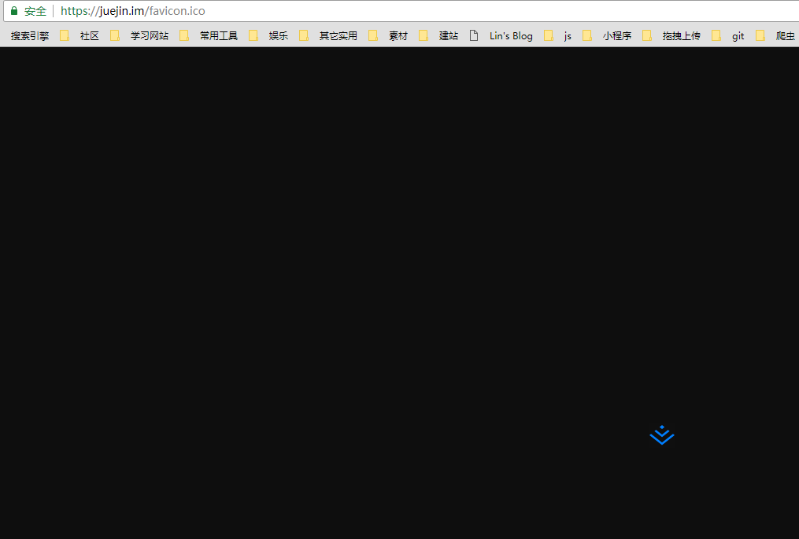
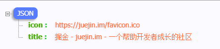

## 根据 url 获取图标及 title

### 功能描述

最近在做一个小项目有一个类似添加书签的功能，用户点击添加后，弹出输入模块，用户只需要将需要收录的链接添加进去，便可以自动生成带有此网站图标和此网站标题的卡片

### 设置 icon

想要知道如何获取肯定要知道网站的 icon 是如何设置的，设置 icon 的方式据我了解的有两种

- 一般都是在 `html` 代码的 `head` 标签中设置一个 `link` 标签，将其 `rel` 属性设置为 "icon" 或者 "shortcut icon",  `href` 就是图标的位置。
- 大部分网站会在其根目录下放置一个`favicon.ico` 文件，也就是网站的图标。



### 获取 icon

两条途径设置 icon，明显解析 html 要相对麻烦一点，因此我们先去网站根目录下去获取 favicon.ico, 如果不存在此文件，再解析 html，当然如果网站本身就没有 icon ，那就自己设置一个默认的图标就好了。

我的思路是拿到需要收录的链接，然后用 `node` 的 `url` 模块去解析，再用 `get` 方法去抓取此网页，如果不是 `200` 就代表根目录下没有此文件。

```js
const express = require('express')
const url = require('url')
const axios = require('axios')

let app = express()


app.get('/',function(req, res) {
  let targetUrl = 'https://github.com/MLuminary'
  let urlString = url.parse(targetUrl)
  let iconUrl = `${urlString.protocol}//${urlString.host}/favicon.ico`
  isHasRootIcon(iconUrl)
})

// 判断网站根目录下是否有 favicon.ico 文件
function isHasRootIcon(url) {
   axios.get(url).then(response=>{
     console.log(1)
   }).catch(error=>{
     console.log(0)
   })
}
```

**以上思路大部分网站还是可以的**，但是有一些网站会遇到重定向的问题，会跳到 404 页面或者 error 页面，**此时返回的 `status` 也是 `200` **，上面的方法就也会认为已找到 icon, 但实际上链接是 `html` 页面，因此我就想能不能获取到重定向后的链接，判断其类型，如果重定向的类型不是 ico、png等图片类型，就也判断为没找到。找来找去发现了 `request` 包可以实现, 下面是具体实现

```js
app.get('/',function(req, res) {
  let targetUrl = 'http://www.12306.cn/mormhweb/'
  let urlString = url.parse(targetUrl)
  let iconUrl = `${urlString.protocol}//${urlString.host}/favicon.ico`
  isHasRootIcon(iconUrl).then(res=>{console.log(res)})
})

// 判断网站根目录下是否有 favicon.ico 文件
function isHasRootIcon(url) {
  let pattern = ['ico','png', 'svg', 'jpg']

  return new Promise((resolve)=>{
    let returnValue = false
    request.get(url,function(err, res) {
      if(res.statusCode === 200) {
        let redirectPath = res.request.uri.path // 重定向的页面路径
        pattern.forEach(item=>{
          if(redirectPath.split('.')[1]===item) {
            // 如果结尾是 pattern 数组中的一种 则返回 true
            returnValue = true
            resolve(returnValue)
          }
        })
      }
      resolve(returnValue)
    })
  })
}
```

如果根目录下不存在 favicon.ico 文件，则需要解析其链接的 html ，然后提取出 icon 的路径，但是这其中还有一些问题，**icon 的路径有可能是绝对路径或者是相对路径**，因此在此还需要在判断一下，下面是具体代码

```js
function resolveHtml(targetUrl) {
  return new Promise(resolve=>{
    let defaultUrl = ''// 自己默认的图片链接
    superagent.get(targetUrl).end(function (err, content) {
      let $ = cheerio.load(content.text)
      let iconUrl = $("link[rel*='icon']").eq(0).attr('href') // 获得 icon 的链接
      // 如果 iconUrl 存在 还需要判断其是否是相对位置
      if(iconUrl) {
        // 如果不存在 'http'
        if(iconUrl.indexOf('http') === -1 ) {
          // 判断是否为相对路径或根路径
          if(iconUrl.charAt(0) === '/') {
            let urlString = url.parse(targetUrl)
            iconUrl = `${urlString.protocol}//${urlString.host}${iconUrl}`
          }else {
            iconUrl = targetUrl + "/" + iconUrl
          }
        }
        resolve(iconUrl)
      }else {
        resolve(defaultUrl)
      }
    })
  })
}
```

获取 icon 连接时为什么我加了一个 `eq(0)` 呢，是因为我发现有些网站有两种类型的 `link` 可以添加图标，一种是`shortcunt icon` 一种是 `icon`，因此我们只要获取其中一个就可以了，两个都获取到可能会报错。

### 获取title

获取 title 就相当于解析 Html 获取 icon, 还是比较简单的，在此就不放代码了。

### 成果

下面就是传入掘金首页抓取到的信息

