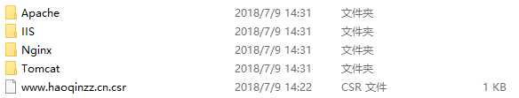

## 引言

这段时间终于感觉自己步入正轨，也相对稳定了下来。便想搞点事情，想做一个网站，包含自己一些平时想要的工具和一些自己想关注的咨询。然后发现自己的服务器竟然一点都不绿，所以就花了一些时间绿化了自己的服务器。

## nginx 上 https

### 申请证书

我自己用的是腾讯云服务器，因此证书就去腾讯云官方网站去申请，当然不是腾讯云的话还有几个比较权威的颁发证书的网站，例如 [StartSSL](https://www.startcomca.com),当然如果你的服务器是 Linux 的话，你也可以用默认安装的 OpenSSL

但是 OpenSSL 的方法我没有试过，具体可以参考 

https://www.cnblogs.com/chjbbs/p/5748369.html

腾讯云的申请证书还是比较简单，打开下述链接

https://console.cloud.tencent.com/ssl

点击申请证书，然后根据其提示一步步填写，审核成功后下载证书，下载证书后里面的文件如下



打开 Nginx，里面包含着一个证书文件和一个 .key 文件。

### 配置 nginx

打开服务器中的 nginx/conf 文件夹，在其中创建一个文件夹为 ssl，再创建一个文件夹为域名，这个完全看自己的习惯，在后面的配置项中只要路径对就可以。我的证书和 .key 文件的位置就在 nginx/conf/ssl/www.haoqinzz.cn/ 下

然后找到 nginx.conf 文件，将其中如下代码解开封印并修改为如下代码

```conf
# HTTPS server
    
    server {
       listen       443;
       server_name  localhost;

       ssl                  on;
       ssl_certificate      ssl/www.haoqinzz.cn/1_www.haoqinzz.cn_bundle.crt;
       ssl_certificate_key  ssl/www.haoqinzz.cn/2_www.haoqinzz.cn.key;

       ssl_session_timeout  5m;

       ssl_protocols  SSLv2 SSLv3 TLSv1;
       ssl_prefer_server_ciphers   on;
       
       ssl_dhparam ssl/certs/dhparam.pem;
       ssl_ciphers "EECDH+ECDSA+AESGCM EECDH+aRSA+AESGCM EECDH+ECDSA+SHA384 EECDH+ECDSA+SHA256 EECDH+aRSA+SHA384 EECDH+aRSA+SHA256 EECDH+aRSA+RC4 EECDH EDH+aRSA !aNULL !eNULL !LOW !3DES !MD5 !EXP !PSK !SRP !DSS !RC4";
       keepalive_timeout 70;
       ssl_session_cache shared:SSL:10m;

       add_header Strict-Transport-Security max-age=63072000;
       add_header X-Frame-Options DENY;
       add_header X-Content-Type-Options nosniff;


       location / {
           root   html;
           index  index.html index.htm;
       }
    }
```

然后再重启一下 nginx 服务即可，然后输入 https://haoqinzz.cn 就可以看到 nginx 的欢迎页，但此时你输入 http://haoqinzz.cn 还是可以访问的，所以如果想要全站都上 https ，还需要修改 http 的服务，将 http 重定向到 https 中

```conf
server {
    listen       80;
    server_name  haoqinzz.cn www.haoqinzz.cn;
    return 301 https://haoqinzz.cn$request_uri;
}
```

这样你输入 http://haoqinzz.cn 会跳到 https://haoqinzz.cn 中，但是现在还存在一个很大的问题，就是我以前的项目也无法访问到了。。

## 让服务器中的项目重新运行

### 基本项目

服务器上 https 后，首页改变了，所有项目都没了，我就去看了一下 nginx 的配置文件

```conf
# HTTPS server
    
    server {
       listen       443;
       server_name  localhost;

       ssl                  on;
       ssl_certificate      ssl/www.haoqinzz.cn/1_www.haoqinzz.cn_bundle.crt;
       ssl_certificate_key  ssl/www.haoqinzz.cn/2_www.haoqinzz.cn.key;

       ssl_session_timeout  5m;

       ssl_protocols  SSLv2 SSLv3 TLSv1;
       ssl_prefer_server_ciphers   on;
       
       ssl_dhparam ssl/certs/dhparam.pem;
       ssl_ciphers "EECDH+ECDSA+AESGCM EECDH+aRSA+AESGCM EECDH+ECDSA+SHA384 EECDH+ECDSA+SHA256 EECDH+aRSA+SHA384 EECDH+aRSA+SHA256 EECDH+aRSA+RC4 EECDH EDH+aRSA !aNULL !eNULL !LOW !3DES !MD5 !EXP !PSK !SRP !DSS !RC4";
       keepalive_timeout 70;
       ssl_session_cache shared:SSL:10m;

       add_header Strict-Transport-Security max-age=63072000;
       add_header X-Frame-Options DENY;
       add_header X-Content-Type-Options nosniff;


       location / {
           root   html;
           index  index.html index.htm;
       }
    }
```

发现 https 的 root 文件夹为 html，因此我将原本的文件迁过来就可以访问了。:fist:

### nginx 反向代理项目

在服务器上我还有过一个用 nginx 实现反向代理的项目，升 https 后毫无疑问 api 全部都是 404 了

找到 nginx 反向代理的配置文件，将 Listen 端口 80 改为 443 ，并将以前的 http 协议都改为 https，然后此时再打开就可以找到 url ，但是会报 502 错误，经过仔细排查后发现这是因为我当时用 http 起的服务，要改为 https 并配置证书文件

```js
var https = require('https');
const fs = require('fs');

const options = {
  key: fs.readFileSync('key文件'),
  cert: fs.readFileSync('crt文件')
};

var server = https.createServer(options,app);
```

这样数据便又可以获取到了