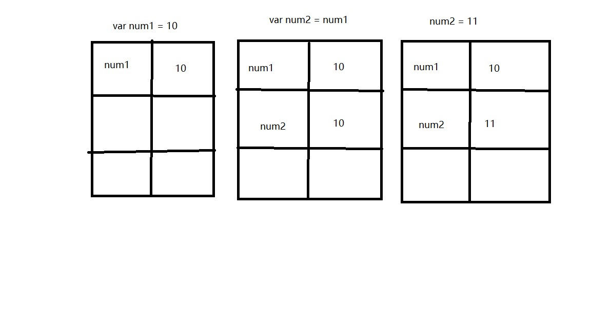
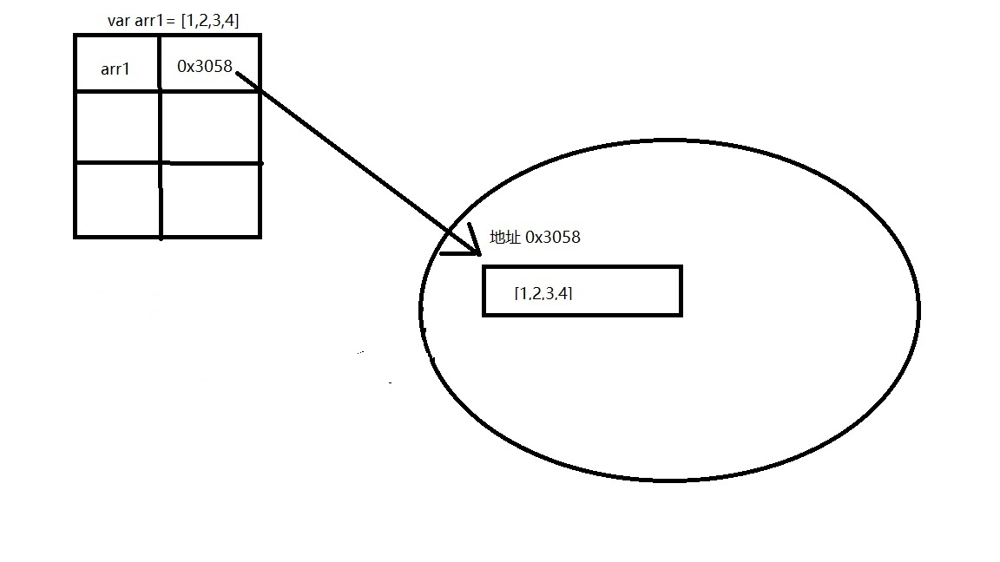
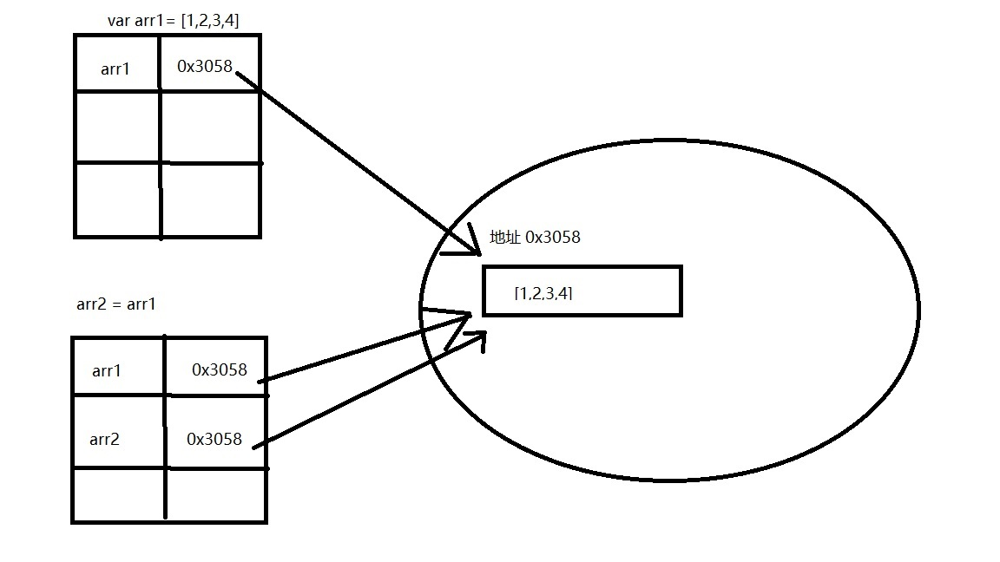
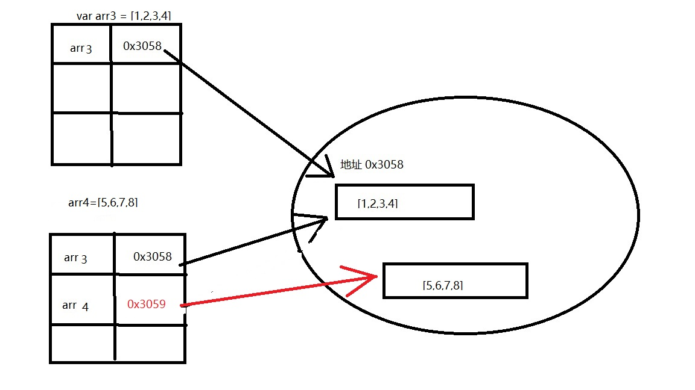

ECMAScript 变量可能包含两种不同的数据类型：「基本数据类型」和「引用数据类型」，这两种类型的值传递是存在不同的.

在我们谈这两种数据类型的值传递前，为了便于理解，我想首先谈一下这两种数据类型有关复制操作存在的不同

## 数据类型的复制

### 基本类型

```javascript
var num1 = 10;
var num2 = num1;
num2 = 11;
console.log(num1); //10
console.log(num2); //11
```

基本数据类型从一个复制到另一个，会在变量对象上**创建**一个新值，然后把该值复制到新变量分配的位置上，改变其中一个不会影响另一个。

本小白用拙劣的画功演示一下



一开始声明变量 `num1` 并赋值为 `10`,它便以图中的形式存放在栈内存中，当用 `num1` 的值来初始化 `num2` 的时候，此时就相当于声明变量 `num2` 并赋值为 `num1` 中的值，**该值只是 `num1` 中的一个副本**，赋值结束，这两个变量便再无瓜葛，进行后面的操作也不会相互影响

### 引用类型

引用类型我们采用数组来讲解，数组的声明有两种方式，一种为 `var 数组名 = []` 另一种为 `var 数组名 = new array()`

```javascript
var arr1 = [1, 2, 3, 4];
var arr2 = arr1;
arr2[0] = 10;
console.log(arr1); //[10,2,3,4]
console.log(arr2); //[10,2,3,4]
```

可以看出输出的结果都为 `[10,2,3,4]`， 和基本数据类型完全不同。数组的存储方式如下图所示



当声明数组变量并赋值的时候，同样也会存入一个结构当中，但是这个结构不能存 `[1,2,3,4]` 这种数据，要存到堆内存中去，就是图片右边那个圆形的区域，但是存入的数据还是要找到它，每个存储位置都有相应的地址，所以它在栈内存中存入的是一个指向数组对象的这样的一个地址。



当复制引用类型变量的时候，同样也会将存储在栈内存中的值复制一份放到为新变量分配的空间中去，只不过因为这个值的副本是一个指向堆中原数组对象的地址，两个变量名就相当于引用了同一个地址中的内容。因此，改变其中的一个，就相当于改变了另一个。

再看下面这个栗子:chestnut:

```javascript
var arr3 = [1, 2, 3, 4];
var arr4 = arr3;
arr4 = [5, 6, 7, 8];
console.log(arr3); //[1,2,3,4]
console.log(arr4); //[5,6,7,8]
```

这个相比于前面那个，只是在第三行代码中出现了不同，`arr4 = []` 这样也是创建数组的一种方式，因此 `arr4=[5,6,7,8]` 是将一个新创建的数组对象赋给变量 `arr4` ,这时 `arr4` 后的地址就改变了,也就指向了新的数组对象，这两个变量也就完全不相同了.



方便理解可以看下下面的代码

```js
console.log(new Array(1,2)===new Array(1,2)) //false
```

那好，现在有了这些铺垫，我们再来谈我们今天的主要内容.

## 数据类型的值传递

### 基本类型

```javascript
var num = 10;

function change(num) {
  num = 11;
  console.log(num); //11
}

change(num);
console.log(num); //10
```

在向参数传递基本类型的值时，被传递的值会被先复制给一个局部变量，其实就可以理解为基本数据类型的赋值。以上的代码也可以写为这样

```javascript
var num = 10;

function change() {
  var num = 10; //look
  num = 11;
  console.log(num); //11
}

change(num);
console.log(num); //10
```

在 look 处，函数会将参数先声明并赋值，值就为下面传入的参数的值，`num` 的值为 `10`,因此赋得值也为 `10`。但此时函数中的 `num` 和函数外部的 `num` 其实是毫不相关的，因此并不会相互影响

### 引用类型

```javascript
var arr = [1, 2, 3, 4];

function change(arr) {
  arr[0] = 10;
  console.log(arr); //[10,2,3,4]
}

change(arr);
console.log(arr); //[10,2,3,4]
```

引用类型也如此，也可以理解为引用类型的复制操作，在函数的开头就会将 `arr` 赋值为传来的数值，虽然也是一开始声明的引用类型的副本，但是因为引用类型传来的数值是地址，因此函数中的 `arr` 和函数外面的 `arr` 都将引用同一个地址中的数组对象，因为 `arr` 指向的数组对象在堆中只有一个，又是全局变量，因此这两个 `arr` 是相同的，同样我们再看那一种声明数组并赋值的.

```javascript
var arr = [1, 2, 3, 4];

function change(arr) {
  arr = [4, 5, 6, 7];
  console.log(arr); //[4,5,6,7]
}

change(arr);
console.log(arr); //[1,2,3,4]
```

那这个也就应该可以理解了，虽然在传参的时候传入的确实是一开始声明的数组对象的地址的副本，但是因为在函数内部又声明了一个新的数组对象，在这里 `arr` 引用的就是一个局部的数组对象了，而这个局部对象就会在函数结束后立即被销毁，不会影响函数外部的数组对象

